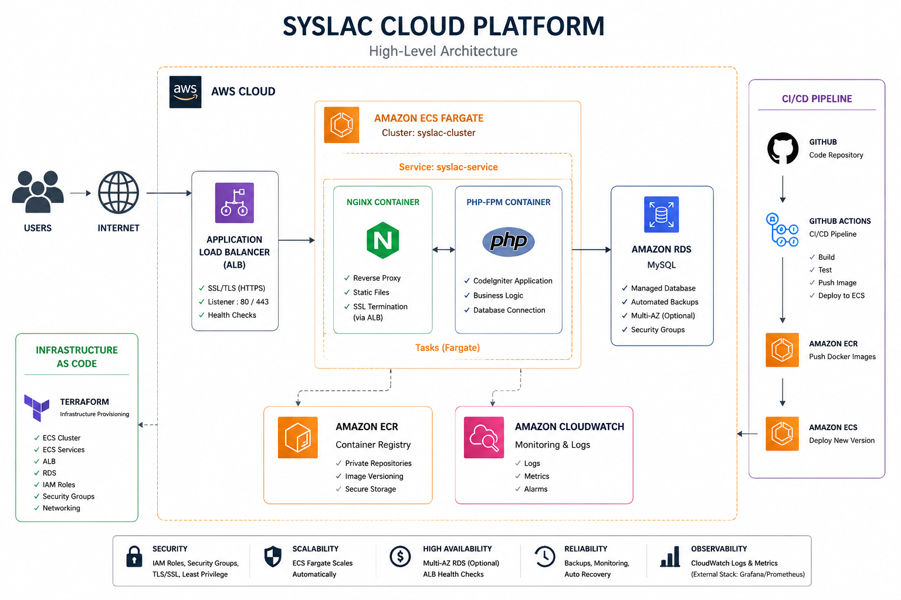
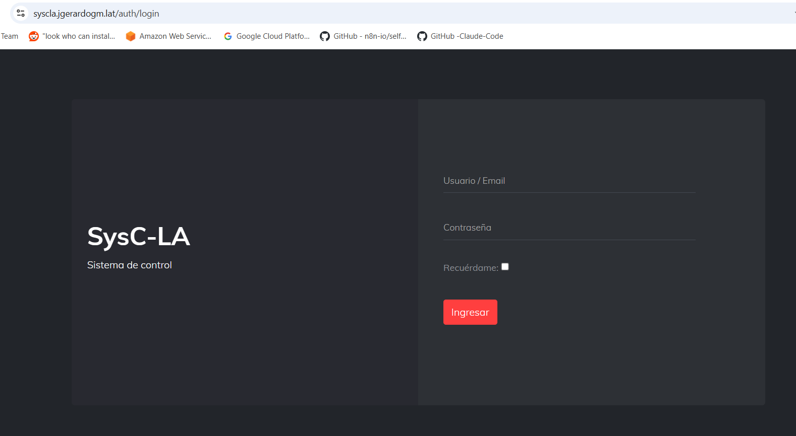
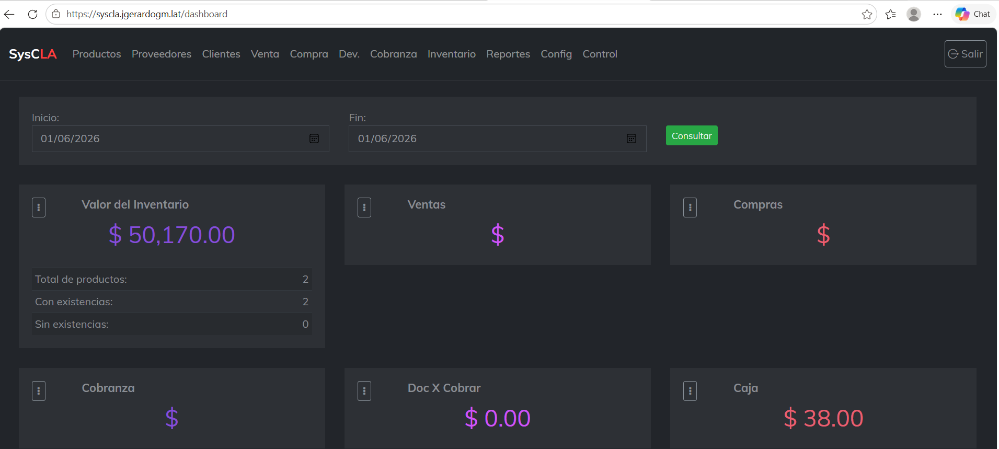
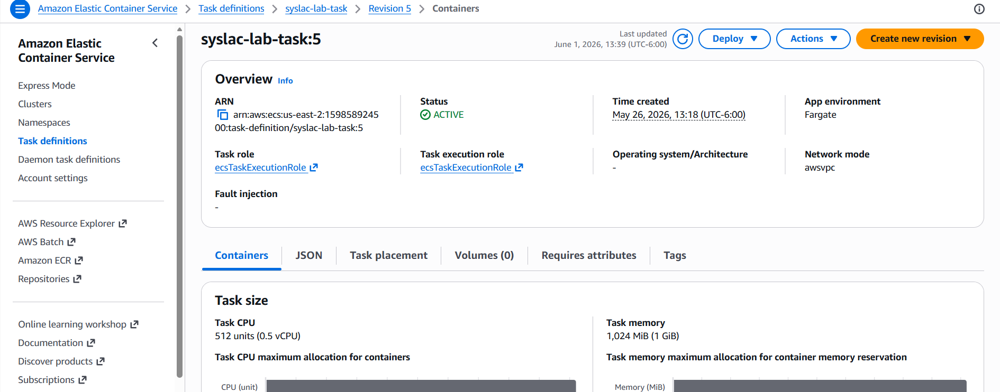
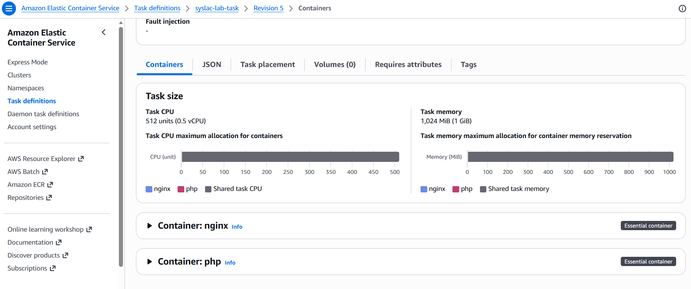
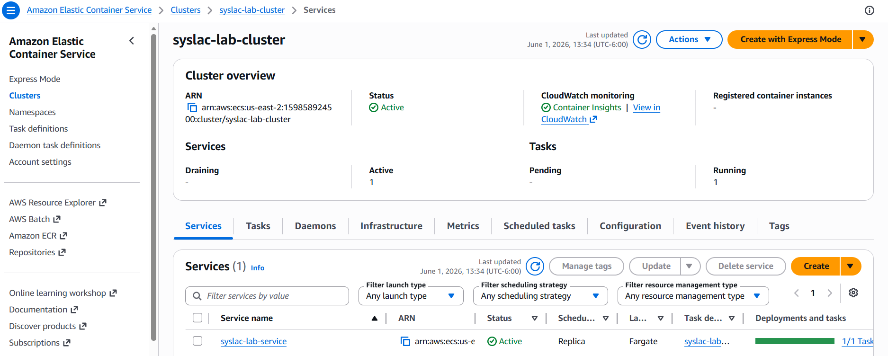
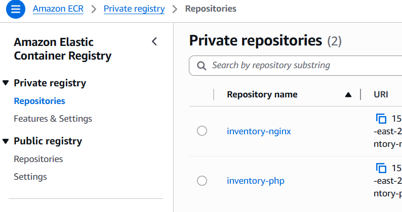
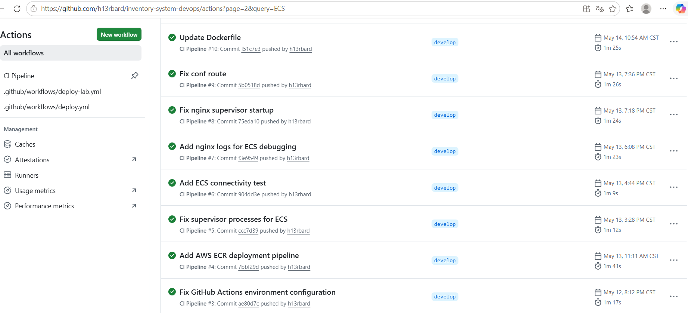

#  Syslac Cloud Platform


Modernization of a legacy inventory management system through containerization, Infrastructure as Code (IaC), cloud-native deployment, and automated CI/CD pipelines on AWS.

---

#  Project Goal

Transform a traditional CodeIgniter-based inventory management application into a modern cloud-native platform using AWS managed services, container orchestration, Infrastructure as Code, and automated deployment workflows.

---

#  Project Overview

Syslac Cloud Platform is a Cloud & DevOps engineering project focused on modernizing a legacy PHP application and deploying it using production-oriented cloud practices.

The project demonstrates:

* Docker containerization
* AWS ECS Fargate orchestration
* Infrastructure as Code with Terraform
* Continuous Integration & Continuous Deployment
* AWS managed services
* Multi-environment deployment strategy
* Production-ready cloud architecture

The primary objective was to create a repeatable, scalable, and maintainable deployment model while preserving application functionality.

---

#  High-Level Architecture



The platform runs on AWS using a containerized architecture based on Amazon ECS Fargate.

Incoming traffic is routed through an Application Load Balancer and distributed to NGINX and PHP-FPM containers running inside ECS tasks.

Container images are stored in Amazon ECR, application data resides in Amazon RDS MySQL, and infrastructure provisioning is managed through Terraform.

Application deployments are fully automated using GitHub Actions.

---

#  AWS Infrastructure

The platform is built entirely on AWS managed services.

## Core Services

| Service                   | Purpose                        |
| ------------------------- | ------------------------------ |
| Amazon ECS Fargate        | Container orchestration        |
| Amazon ECR                | Private container registry     |
| Amazon RDS MySQL          | Managed relational database    |
| Application Load Balancer | HTTPS traffic distribution     |
| IAM                       | Identity and access management |
| CloudWatch                | Logging and monitoring         |
| Route53 / DNS             | Domain management              |

---

#  Container Architecture

The application is deployed as a multi-container workload.

## NGINX Container

Responsibilities:

* Reverse proxy
* HTTP request handling
* Static asset delivery
* Traffic routing
* Frontend web server

## PHP-FPM Container

Responsibilities:

* CodeIgniter runtime
* Business logic execution
* Database communication
* Backend processing
* API handling

Container images are versioned and stored in Amazon ECR.

---

#  Infrastructure as Code

Infrastructure provisioning and management are automated using Terraform.

## Managed Resources

* ECS Clusters
* ECS Services
* Task Definitions
* Application Load Balancers
* Target Groups
* IAM Roles
* Security Groups
* Networking Components
* RDS Resources

### Repository Structure

```text
terraform/
├── backend.tf
├── enviroments
│   └── prod
├── main.tf
├── modules
│   ├── alb
│   │   ├── main.tf
│   │   ├── outputs.tf
│   │   └── variables.tf
│   ├── ecr
│   ├── ecs
│   │   ├── main.tf
│   │   ├── outputs.tf
│   │   ├── service.tf
│   │   ├── task-definitions.tf
│   │   └── variables.tf
│   ├── monitoring
│   ├── networking
│   │   ├── main.tf
│   │   ├── outputs.tf
│   │   └── variables.tf
│   └── waf
├── outputs.tf
├── providers.tf
├── terraform.tfvars
├── variables.tf
└── versions.tf
```

### Benefits

* Version-controlled infrastructure
* Consistent deployments
* Reduced manual configuration
* Repeatable environments
* Simplified recovery processes

---

#  CI/CD Pipeline

Application deployments are automated through GitHub Actions.

## Deployment Flow

```text
Developer
    │
    ▼
GitHub Repository
    │
    ▼
GitHub Actions
    │
    ▼
Build Docker Images
    │
    ▼
Amazon ECR
    │
    ▼
Amazon ECS
    │
    ▼
Deploy New Version
```

## Current Features

 Automated Docker image builds

 Automated image publishing to Amazon ECR

 ECS service deployments

 Deployment validation

 Environment separation (Production / Lab)

 Version-controlled workflows

---

#  Security

Current security controls include:

* HTTPS/TLS encryption
* AWS IAM roles
* ECS execution roles
* Security Groups
* Private container registry
* Managed database service

### Planned Enhancements

* AWS Secrets Manager integration
* Secret rotation
* Enhanced IAM segmentation
* Immutable deployments
* Automated security validation

---

#  Project Screenshots

## Application



---

## ECS Service



---

## ECS Cluster



---

## Amazon ECR



---

## GitHub Actions Deployment



---

#  Key Achievements

* Migrated a legacy CodeIgniter application to AWS ECS Fargate.
* Designed a multi-container architecture using NGINX and PHP-FPM.
* Implemented Infrastructure as Code using Terraform.
* Automated deployments through GitHub Actions.
* Integrated Amazon ECR as a private container registry.
* Configured HTTPS-enabled production workloads.
* Built separate Production and Lab environments.
* Established repeatable deployment workflows.

---

#  Lessons Learned

This project provided practical experience in:

* Cloud Architecture
* AWS ECS Operations
* Containerization
* Infrastructure as Code
* CI/CD Design
* Application Modernization
* Production Deployments
* Cloud Cost Optimization

For a detailed breakdown of challenges and lessons learned:

```text
LESSONS-LEARNED.md
```

---

#  Future Improvements

## Security

* AWS Secrets Manager
* Secret rotation
* Advanced IAM policies

## CI/CD

* ECS Task Definition Revisioning
* Immutable image deployments
* Automated rollback strategies

## Infrastructure

* Full Terraform coverage
* Multi-environment provisioning
* Disaster recovery automation

## Scalability

* Auto Scaling Policies
* Blue/Green Deployments
* Advanced monitoring integration

---

# 💻 Author

h13rbard

Cloud & DevOps Engineering Portfolio Project

Built with AWS ECS Fargate, Amazon ECR, Amazon RDS MySQL, Terraform, Docker, GitHub Actions, NGINX, PHP-FPM and CodeIgniter.

